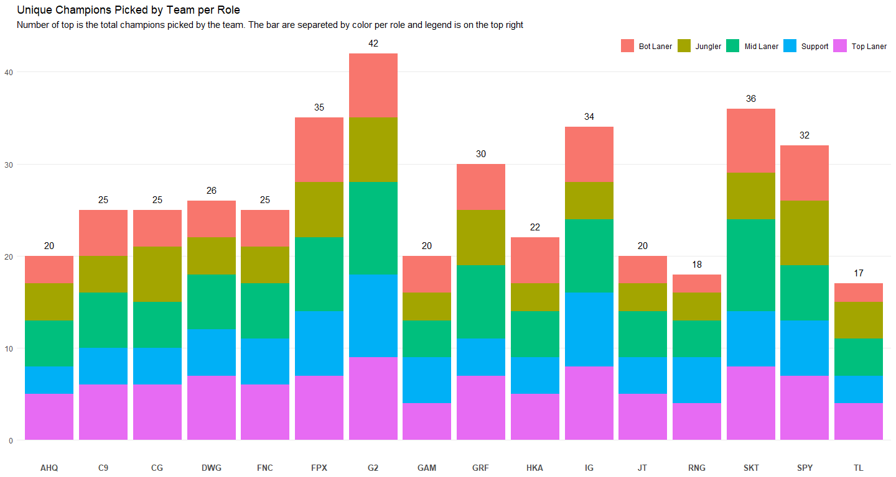
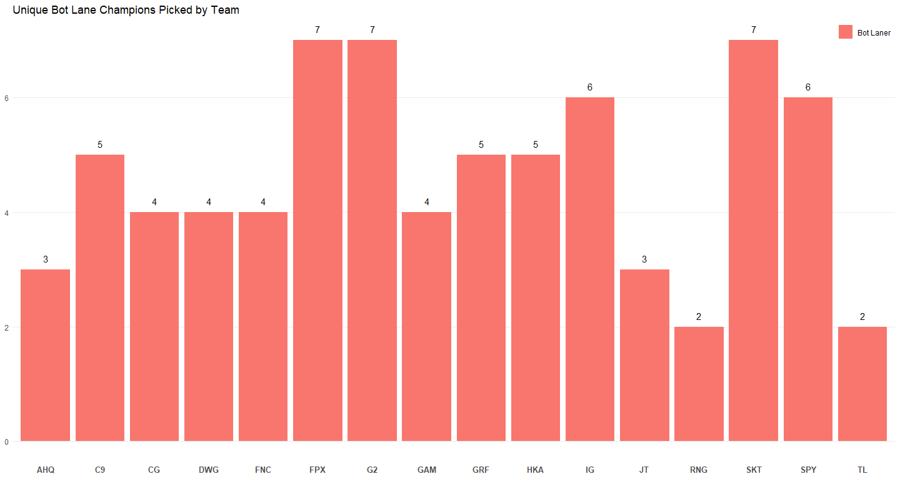
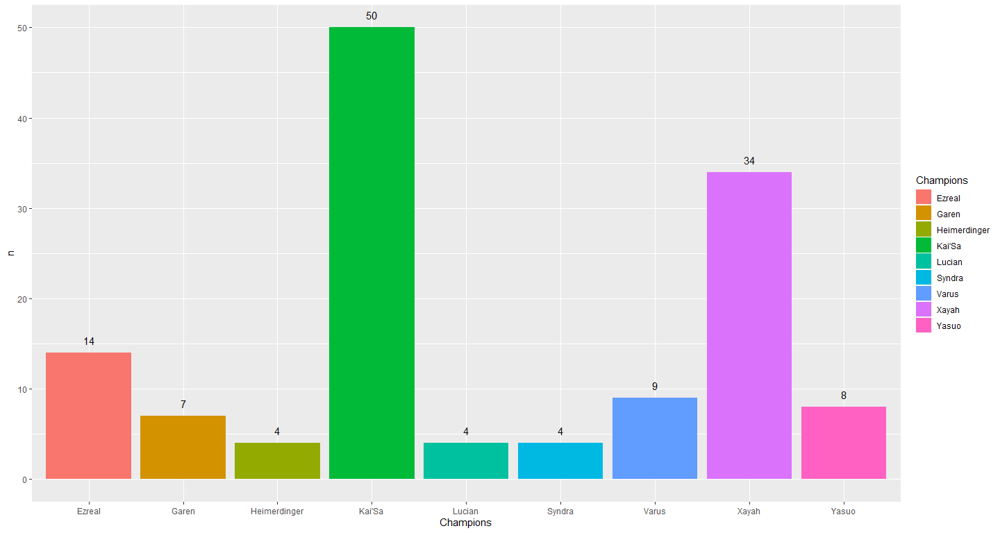
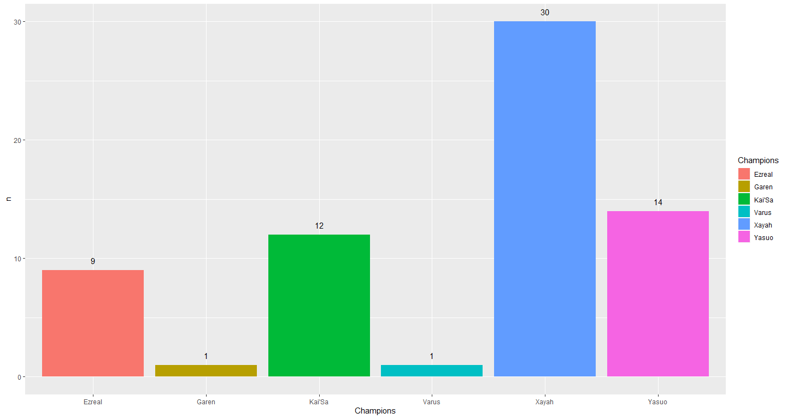
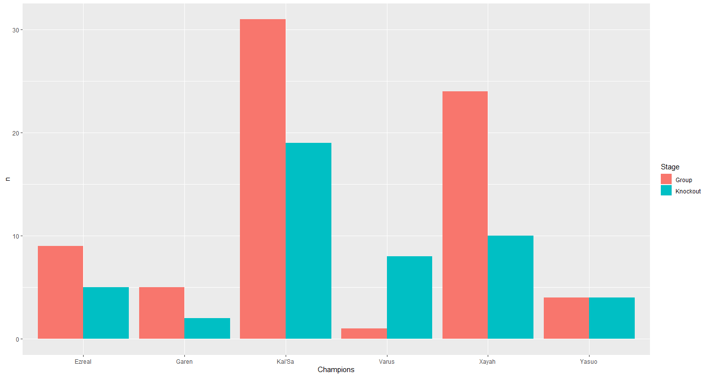
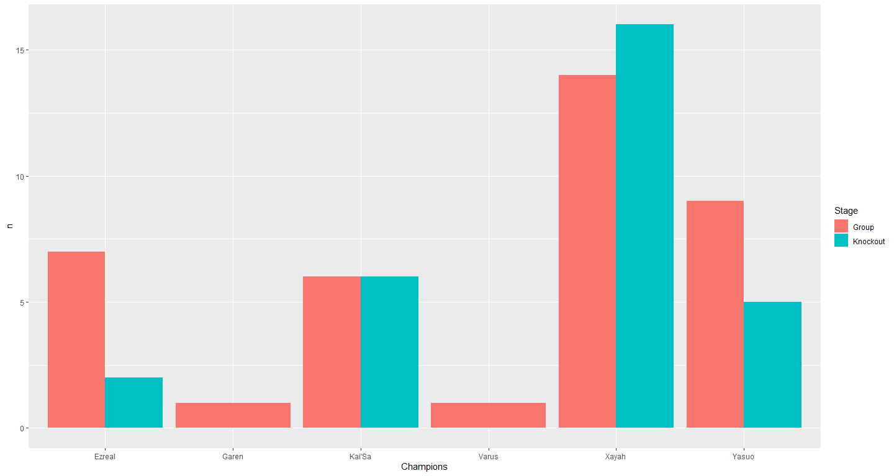
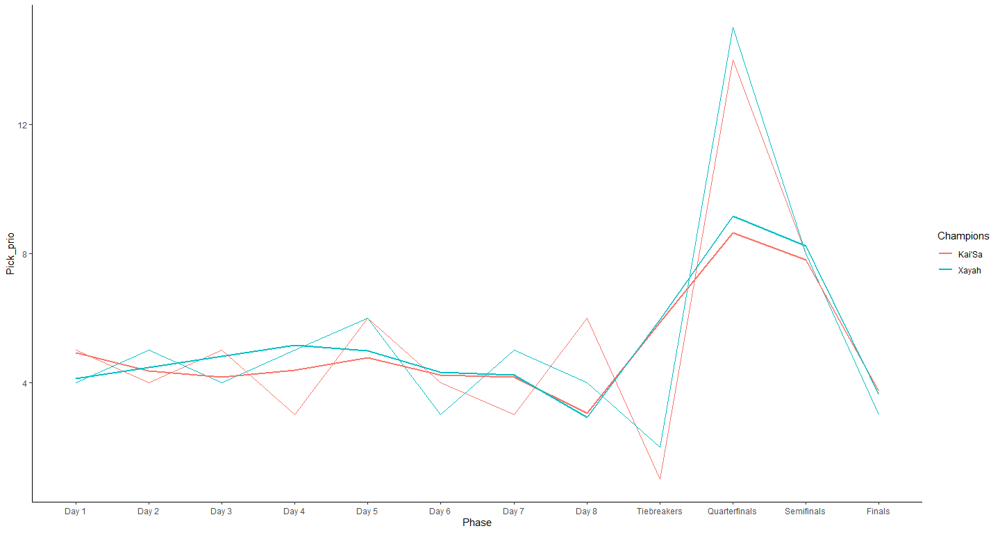

Bot Lane Analysis
================

## Bot Lane Analysis

Lets start out and see how many unique champions where picked by each
Team

<!-- -->
<!-- -->
\# Bot Picks

<!-- -->
\# Common Bot lane picks Basically Kai’sa vs Xayah

<!-- -->
Lets see if Bans reflect how often the champions were picked
<!-- -->
They do cause Kai’sai is more popular than Xayah but thats because Xayah
is ban more often. There for Xayah is stronger?

# Frequency of the picks between Groups and Knockout

But did the frequency changed the group stage and the Knockout stage

``` r
Picks_df %>%
  group_by(Role, Stage) %>%
  filter(Champions %in% Picks_common_bot_df$Champions)%>%
  count(Champions) %>%
  filter(Role == 'Bot Laner')%>%
  ggplot(mapping = aes(x = Champions, y = n, fill = Stage))+
  geom_bar(position = 'dodge', stat = 'identity')
```

<!-- -->
Nah but same thing could be said about bans too

``` r
Bans_df %>%
  group_by(Stage) %>%
  filter(Champions %in% Picks_common_bot_df$Champions)%>%
  count(Champions) %>%
  ggplot(mapping = aes(x = Champions, y = n, fill = Stage))+
  geom_bar(position = 'dodge', stat = 'identity')
```

<!-- -->
\# Looking throughout the Worlds 2019

``` r
Picks_popular_bot_df<- head(arrange(Picks_common_bot_df,desc(total)),n = 2)

Picks_bot_phase_count<- Picks_df %>%
  group_by(Role, Phase) %>%
  filter(Champions %in% Picks_common_bot_df$Champions)%>%
  count(Champions) %>%
  filter(Role == 'Bot Laner')

Bans_bot_common_phase_count<- Bans_df %>%
  group_by(Phase)%>%
  filter(Champions %in% Picks_common_bot_df$Champions)%>%
  count(Champions)
Picks_bot_phase_count$Phase <- factor(Picks_bot_phase_count$Phase, levels = c('Day 1','Day 2','Day 3','Day 4','Day 5',
                                                                              'Day 6','Day 7','Day 8','Tiebreakers',
                                                                              'Quarterfinals','Semifinals','Finals'))
Bans_bot_common_phase_count$Phase <- factor(Bans_bot_common_phase_count$Phase, levels = c('Day 1','Day 2','Day 3','Day 4',
                                                                                    'Day 5','Day 6','Day 7','Day 8',
                                                                                    'Tiebreakers','Quarterfinals',
                                                                                    'Semifinals','Finals'))

Picks_bot_phase_count <- Picks_bot_phase_count%>%
  left_join(Bans_bot_common_phase_count, by = c('Champions','Phase'))


Picks_bot_phase_count[is.na(Picks_bot_phase_count)] <- 0

Picks_bot_phase_count%>%
  filter(Champions %in% Picks_popular_bot_df$Champions)%>%
  mutate(Pick_prio = n.x + n.y) %>%
  ggplot(mapping = aes(x = Phase, y = Pick_prio, color = Champions, group = Champions))+
  geom_line()+
  geom_smooth(method = 'loess', se = FALSE, span = 0.6) +
  theme_classic()
```

<!-- -->

``` r
  #stat_smooth(aes(y = n.x)) +
  #geom_text(aes(label = Champions, y = n.x),
   #         position = position_dodge(width = 1),
    #        vjust = -1) +
  #geom_point(aes(y = n.x, color = n.x)) +
# geom_smooth(aes(y = n.x))+
  #facet_grid(~Champions)
```

So Kai’sa and Xayah always? Yup, I really do think that in terms of
champion diversity riot failed when it came to Bot lane.

# Champion changes before worlds 2019
